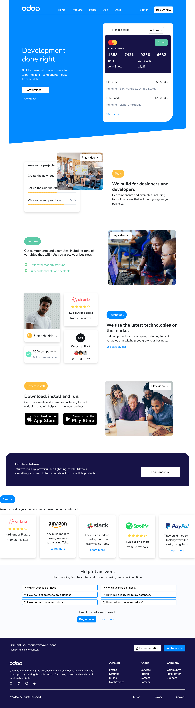

# FWeb Designer - Odoo challenge solution

## Table of contents

- [Overview](#overview)
  - [The challenge](#the-challenge)
  - [Screenshot](#screenshot)
  - [Links](#links)
- [My process](#my-process)
  - [Built with](#built-with)
  - [What I learned](#what-i-learned)
  - [What would you improve?](#What-would-you-improve?)
  - [What do you find good/bad in this mock-up?](#What-do-you-find-good/bad-in-this-mock-up?)
- [Author](#author)


## Overview

### The challenge

Users should be able to:

- View the optimal layout for the interface depending on their device's screen size
- See hover and focus states for buttons on the page
- See transitions on some elements on the page

### Screenshot




### Links

- Live Site URL: [Netlify](https://challenge-odoo.netlify.app/)

## My process

### Built with

- Semantic HTML5 markup
- SCSS properties (GULP/SASS)
- Flexbox
- CSS Grid
- Mobile-first workflow
- JavaScript


### What I learned

Here I learned how to create a skewed background and practice my skills in SCSS y Bootstrap because I usually don't use them.

```html
<div class="skew"></div>

```
```css
.skew{
    background-color: v.$white;
    width: 100.1%;
    height: 170px;
    position: absolute;
    bottom: -1px;
    clip-path: polygon(100% 50%, 0 100%, 100% 100%);
}
```


### What would you improve?

Definitely work more on transitions, there are many things that I would like to do but I still need to learn a lot. And of course some details that I saw in my code when I published it.


### What do you find good/bad in this mock-up?

- Maybe the skewed backgrounds, they are nice but they cause some visual noise in the layout, like the "infinite solutions" section, I still don't know how, but it can be arranged in a different and more harmonious way.


## Author

- Website - [Yeni Viveros Montes](https://curriculum-yvm.netlify.app)
- LinkedIn - [Yeni Viveros Montes](https://www.linkedin.com/in/yeni-viveros-montes)


